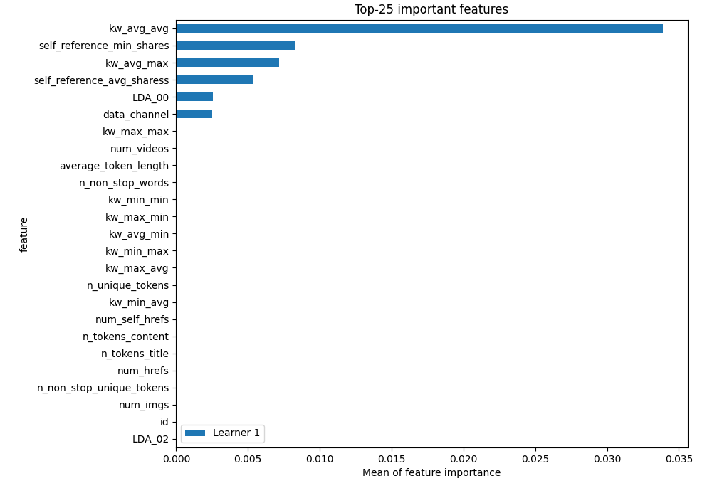
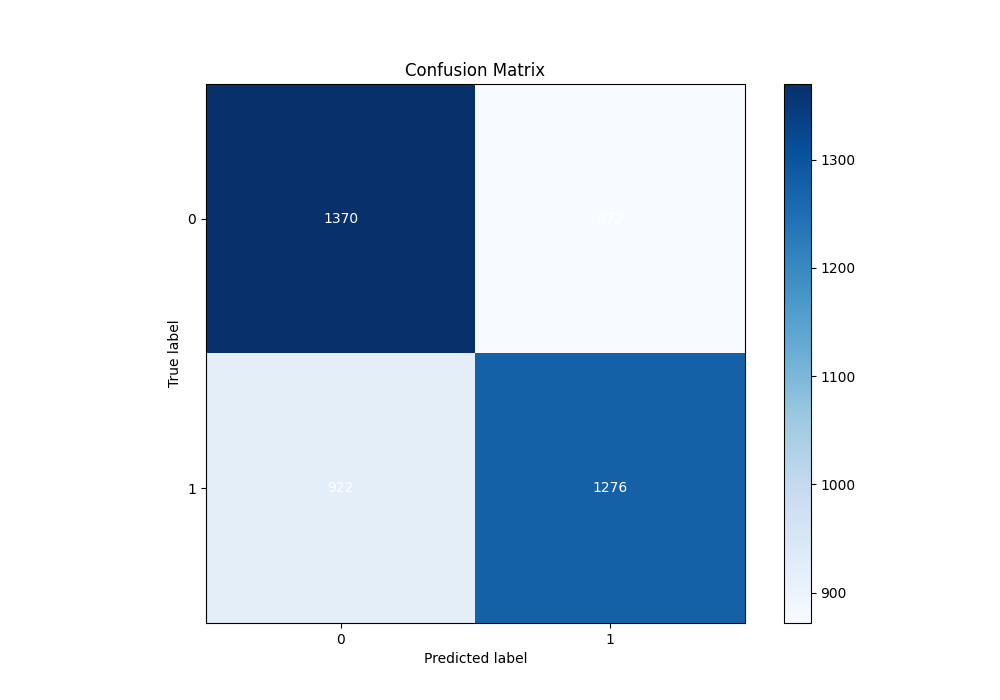
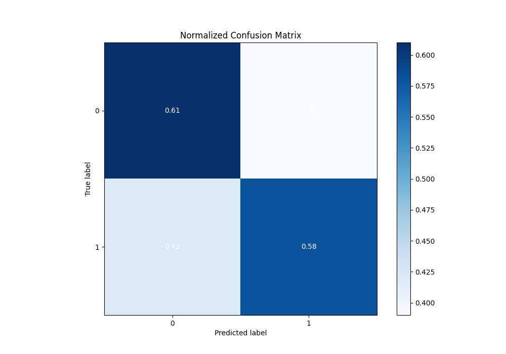
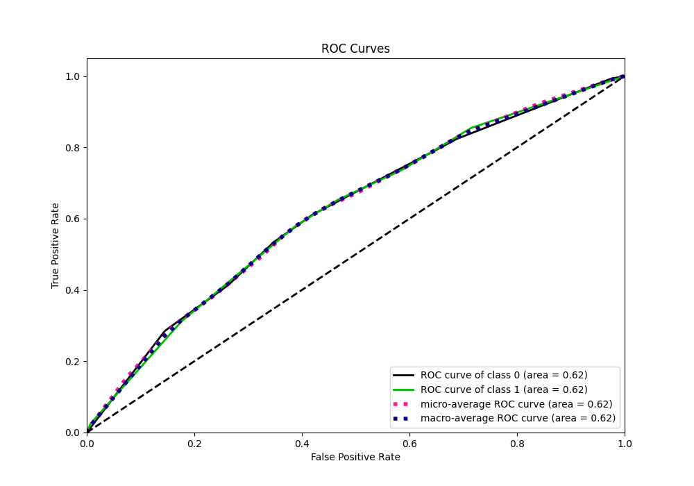
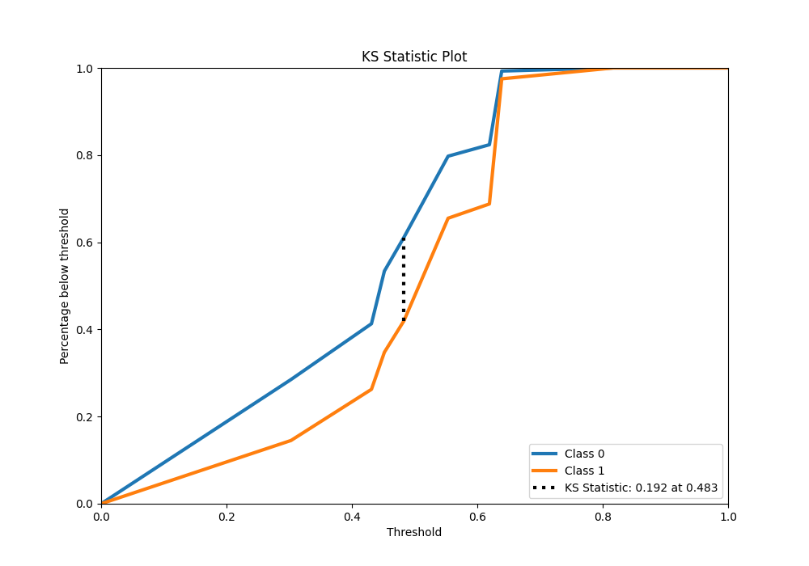
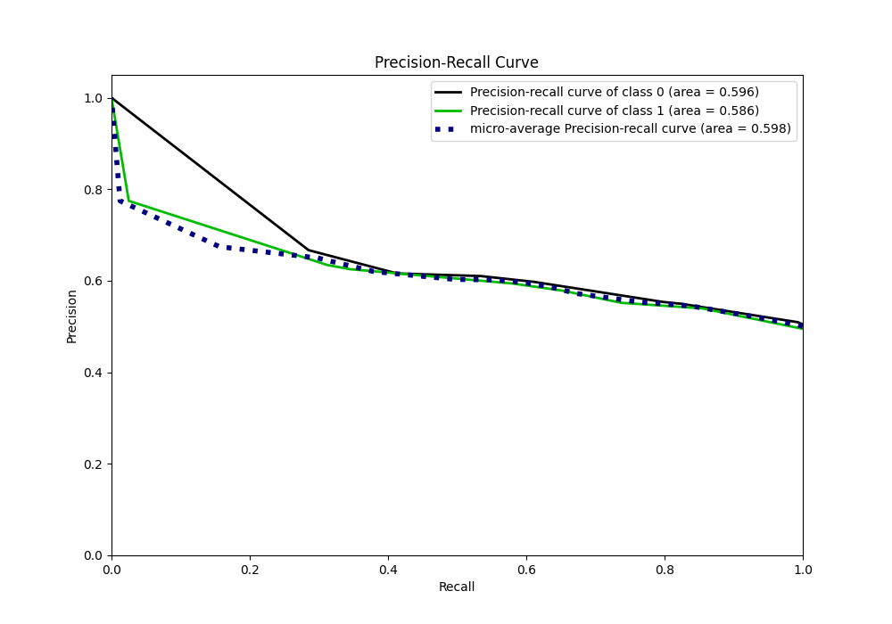
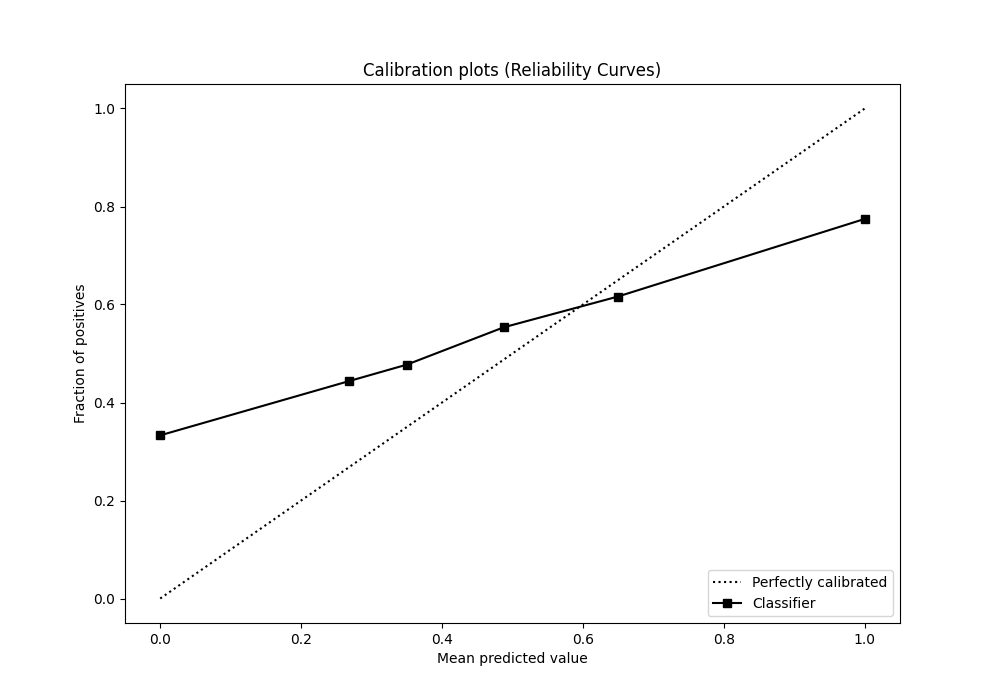
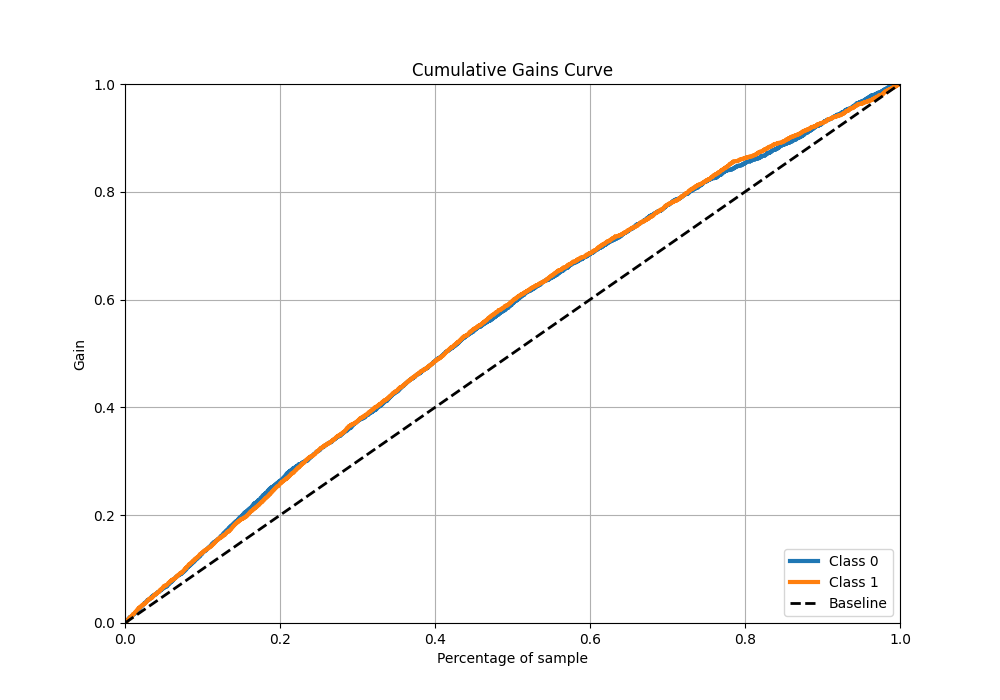
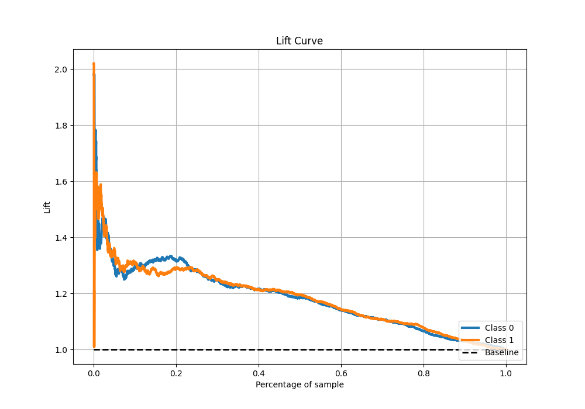

# Summary of 2_DecisionTree

[<< Go back](../README.md)

## Decision Tree
- **n_jobs**: -1
- **criterion**: gini
- **max_depth**: 3
- **explain_level**: 1

## Validation
 - **validation_type**: split
 - **train_ratio**: 0.75
 - **shuffle**: True
 - **stratify**: True

## Optimized metric
logloss

## Training time

6.3 seconds

## Metric details
|           |    score |   threshold |
|:----------|---------:|------------:|
| logloss   | 0.66961  |  nan        |
| auc       | 0.621314 |  nan        |
| f1        | 0.662248 |    0.272546 |
| accuracy  | 0.595946 |    0.482857 |
| precision | 0.774648 |    0.638926 |
| recall    | 1        |    0.272546 |
| mcc       | 0.191681 |    0.482857 |

## Metric details with threshold from accuracy metric
|           |    score |   threshold |
|:----------|---------:|------------:|
| logloss   | 0.66961  |  nan        |
| auc       | 0.621314 |  nan        |
| f1        | 0.587207 |    0.482857 |
| accuracy  | 0.595946 |    0.482857 |
| precision | 0.594041 |    0.482857 |
| recall    | 0.580528 |    0.482857 |
| mcc       | 0.191681 |    0.482857 |

## Confusion matrix (at threshold=0.482857)
|              |   Predicted as 0 |   Predicted as 1 |
|:-------------|-----------------:|-----------------:|
| Labeled as 0 |             1370 |              872 |
| Labeled as 1 |              922 |             1276 |

## Learning curves

## Permutation-based Importance

## Confusion Matrix

## Normalized Confusion Matrix

## ROC Curve

## Kolmogorov-Smirnov Statistic

## Precision-Recall Curve

## Calibration Curve

## Cumulative Gains Curve

## Lift Curve

[<< Go back](../README.md)
