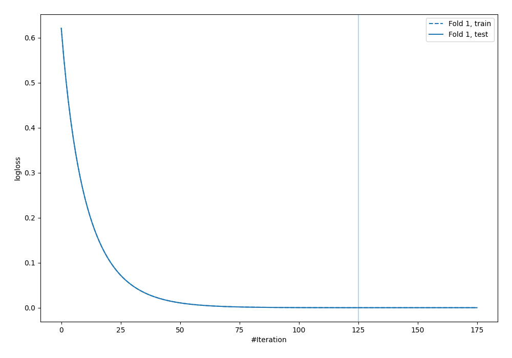
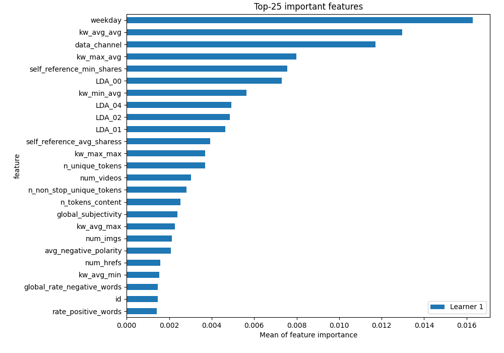
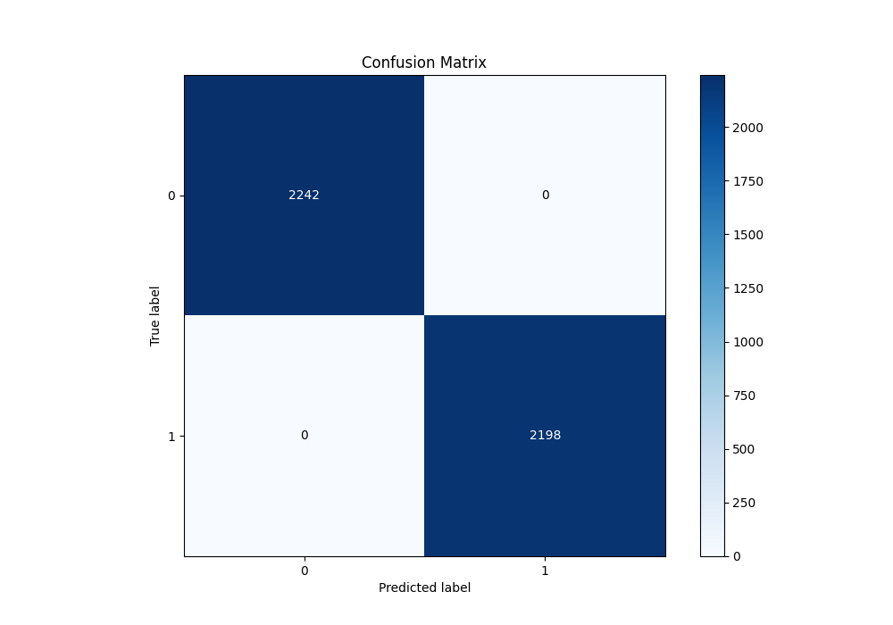
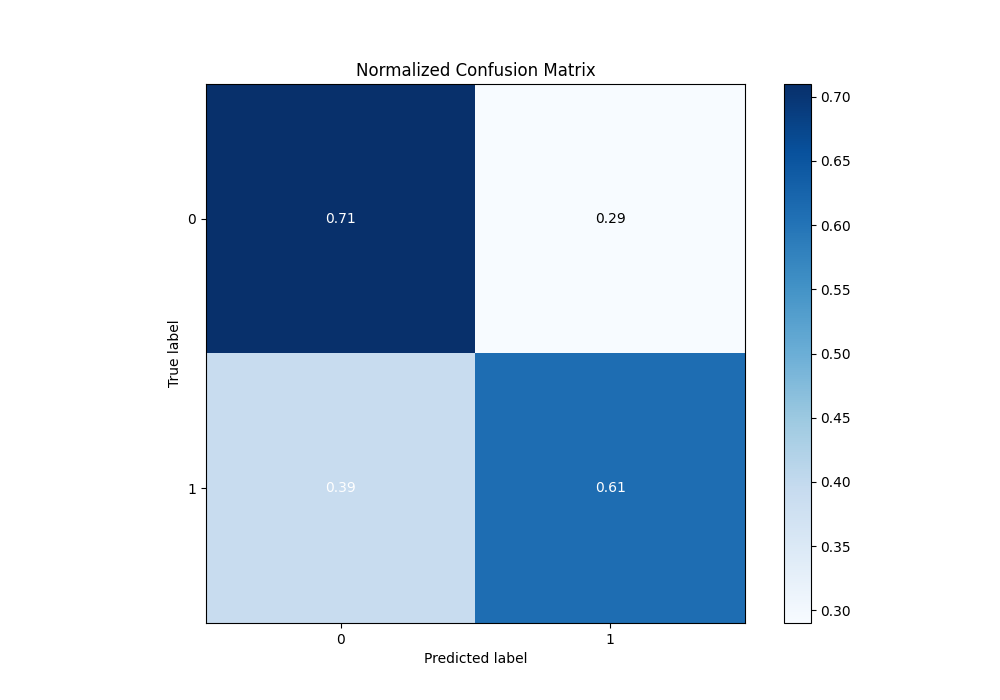
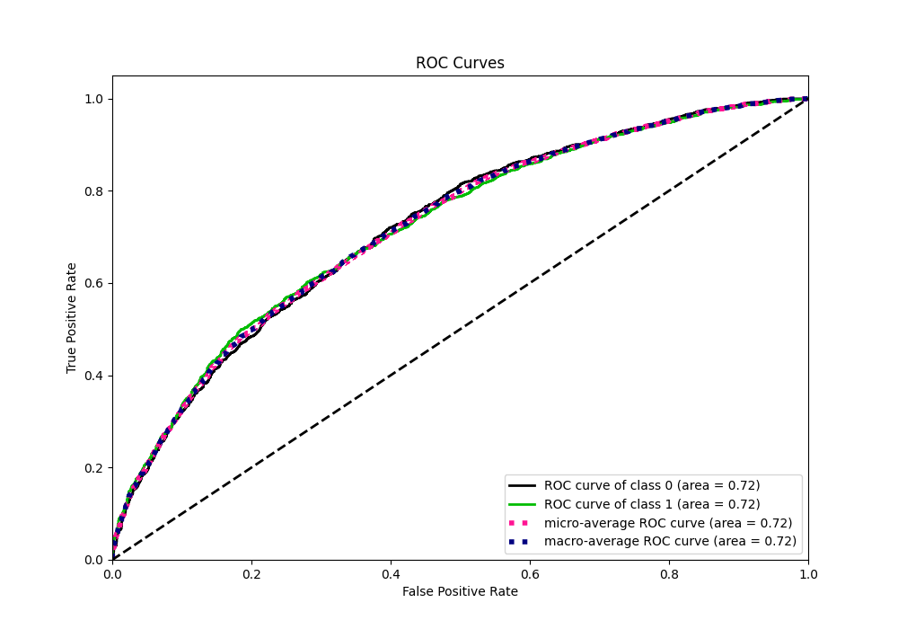
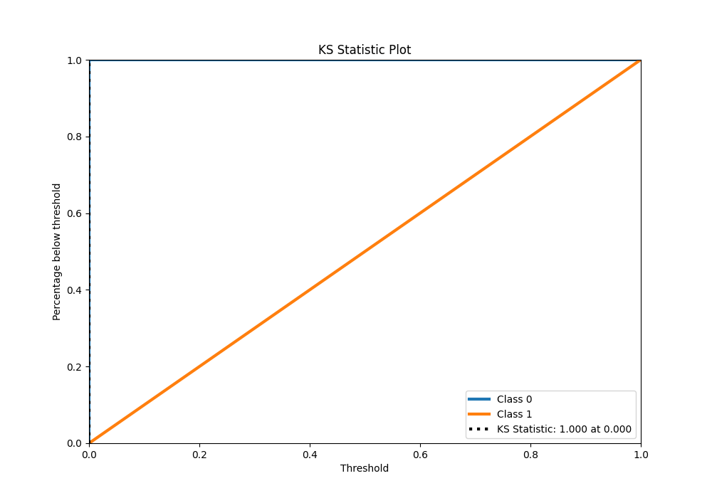
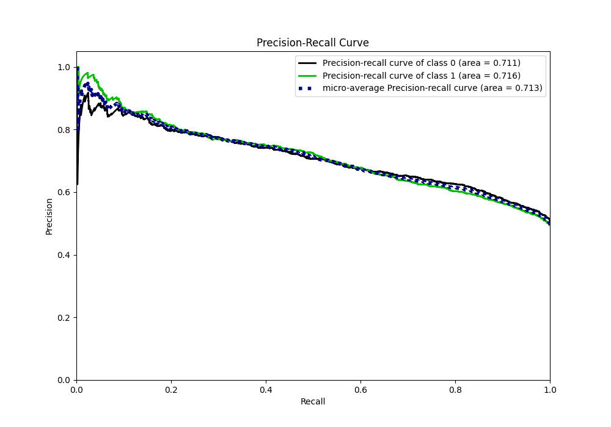
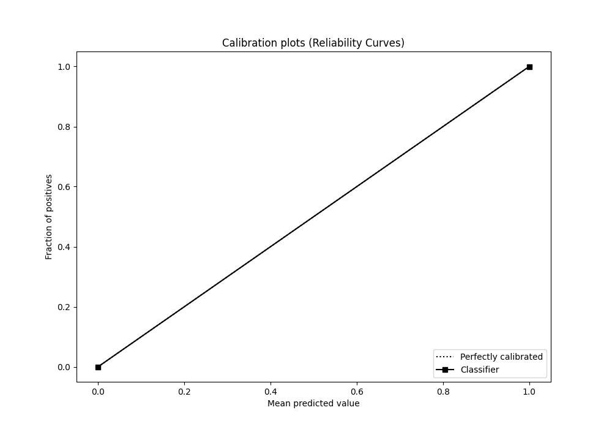
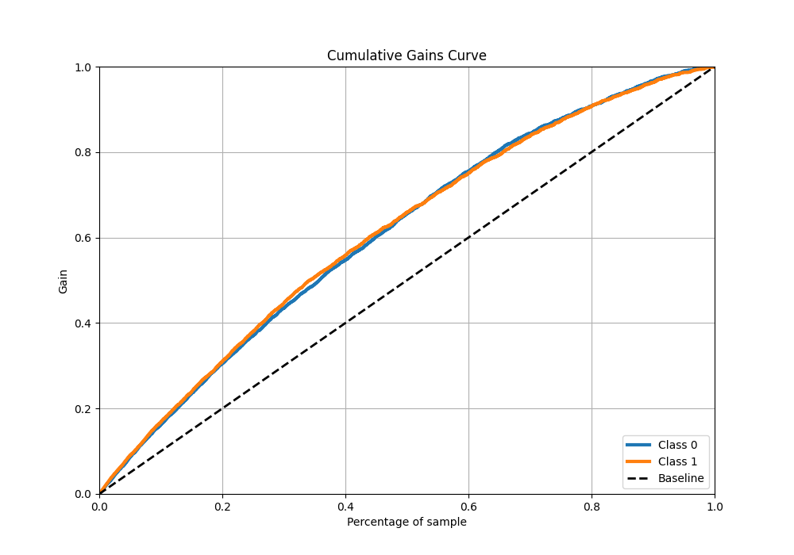
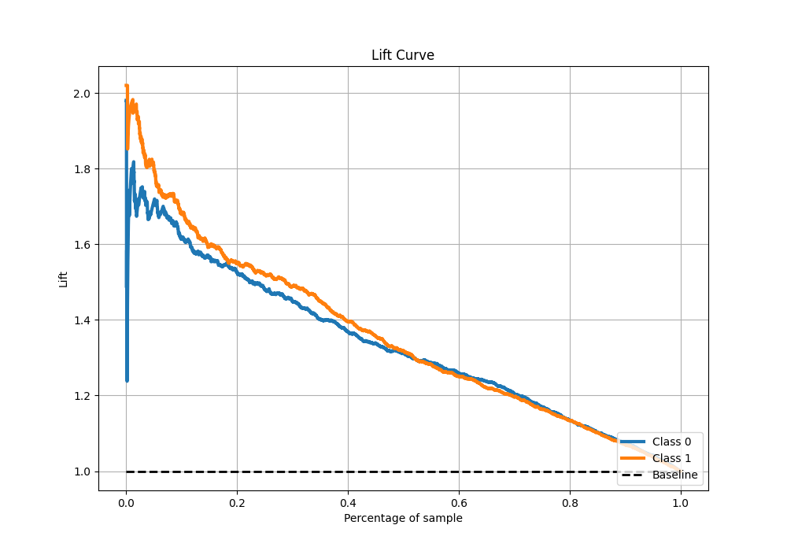

# Summary of 3_Default_Xgboost

[<< Go back](../README.md)

## Extreme Gradient Boosting (Xgboost)
- **n_jobs**: -1
- **objective**: binary:logistic
- **eta**: 0.075
- **max_depth**: 6
- **min_child_weight**: 1
- **subsample**: 1.0
- **colsample_bytree**: 1.0
- **eval_metric**: logloss
- **explain_level**: 1

## Validation
 - **validation_type**: split
 - **train_ratio**: 0.75
 - **shuffle**: True
 - **stratify**: True

## Optimized metric
logloss

## Training time

2.6 seconds

## Metric details
|           |    score |   threshold |
|:----------|---------:|------------:|
| logloss   | 0.614597 | nan         |
| auc       | 0.720936 | nan         |
| f1        | 0.695505 |   0.374573  |
| accuracy  | 0.660135 |   0.544515  |
| precision | 0.963855 |   0.889095  |
| recall    | 1        |   0.0233995 |
| mcc       | 0.329921 |   0.610378  |

## Metric details with threshold from accuracy metric
|           |    score |   threshold |
|:----------|---------:|------------:|
| logloss   | 0.614597 |  nan        |
| auc       | 0.720936 |  nan        |
| f1        | 0.63839  |    0.544515 |
| accuracy  | 0.660135 |    0.544515 |
| precision | 0.67443  |    0.544515 |
| recall    | 0.606005 |    0.544515 |
| mcc       | 0.321154 |    0.544515 |

## Confusion matrix (at threshold=0.544515)
|              |   Predicted as 0 |   Predicted as 1 |
|:-------------|-----------------:|-----------------:|
| Labeled as 0 |             1599 |              643 |
| Labeled as 1 |              866 |             1332 |

## Learning curves

## Permutation-based Importance

## Confusion Matrix

## Normalized Confusion Matrix

## ROC Curve

## Kolmogorov-Smirnov Statistic

## Precision-Recall Curve

## Calibration Curve

## Cumulative Gains Curve

## Lift Curve

[<< Go back](../README.md)
