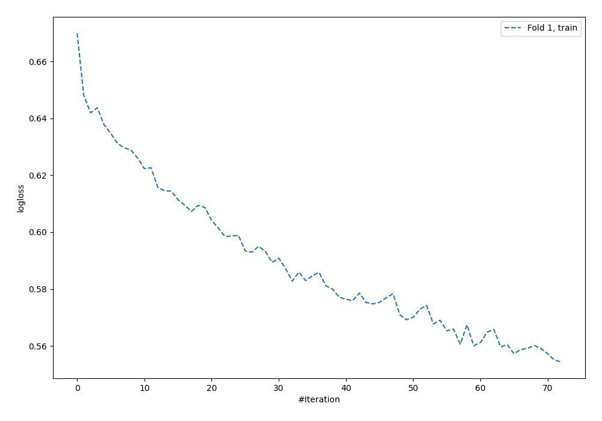
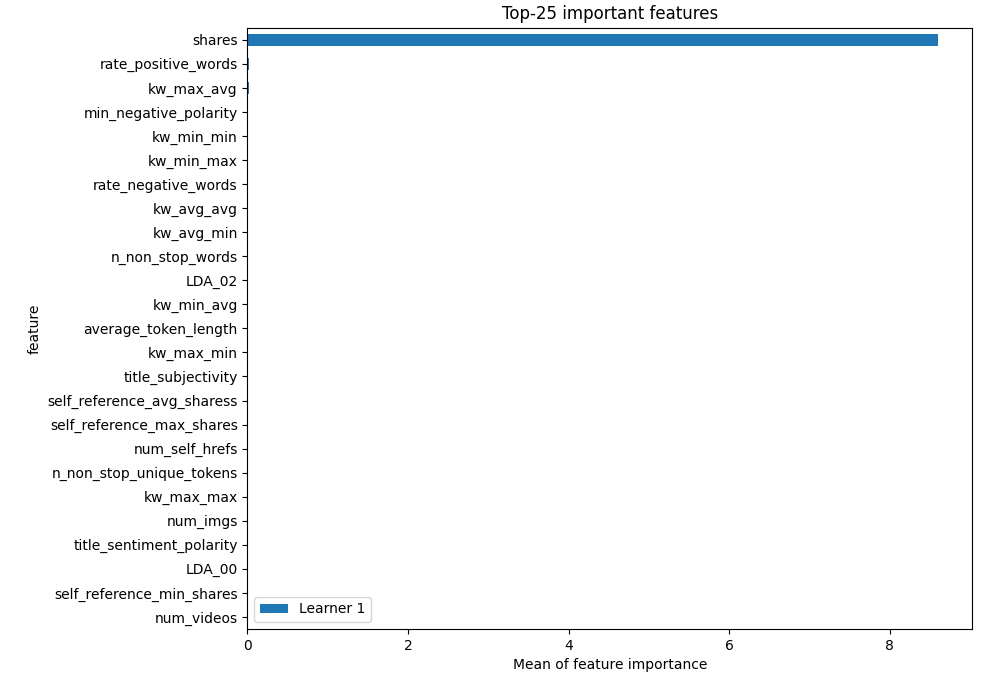
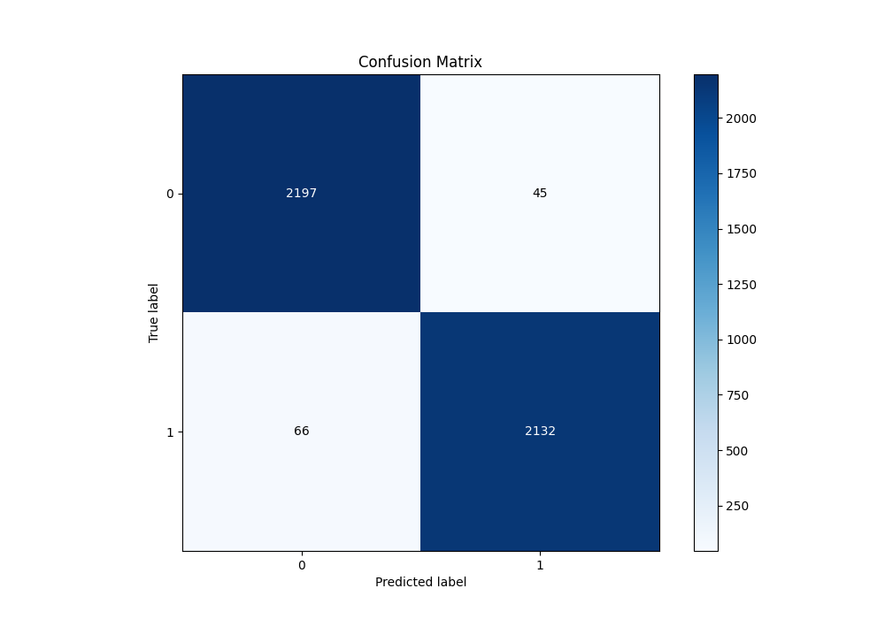
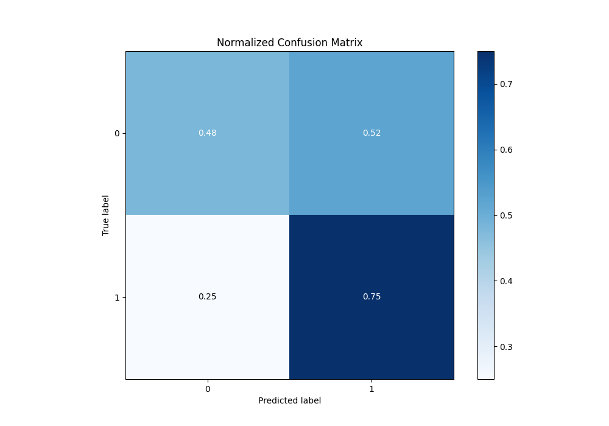
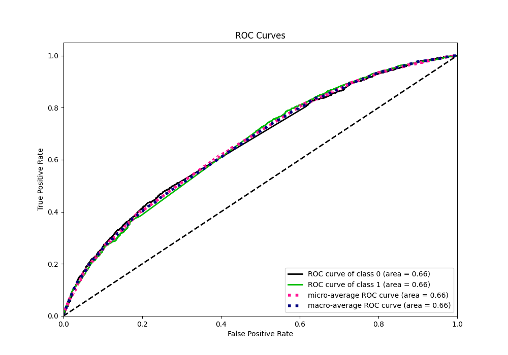
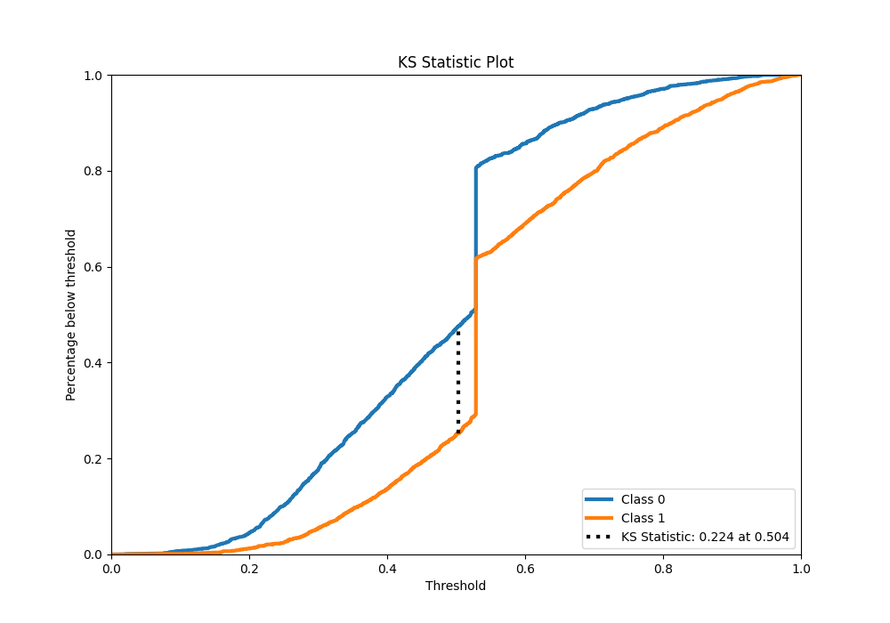
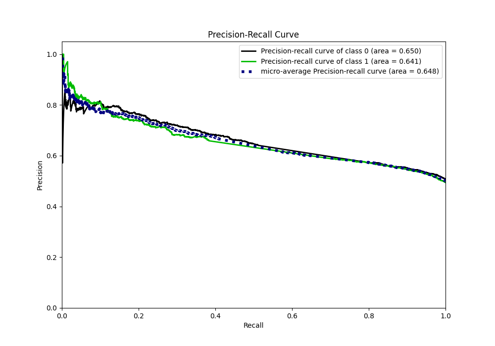
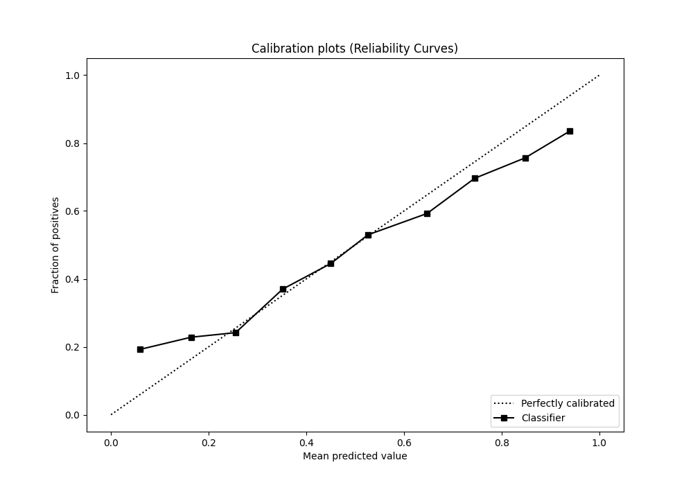
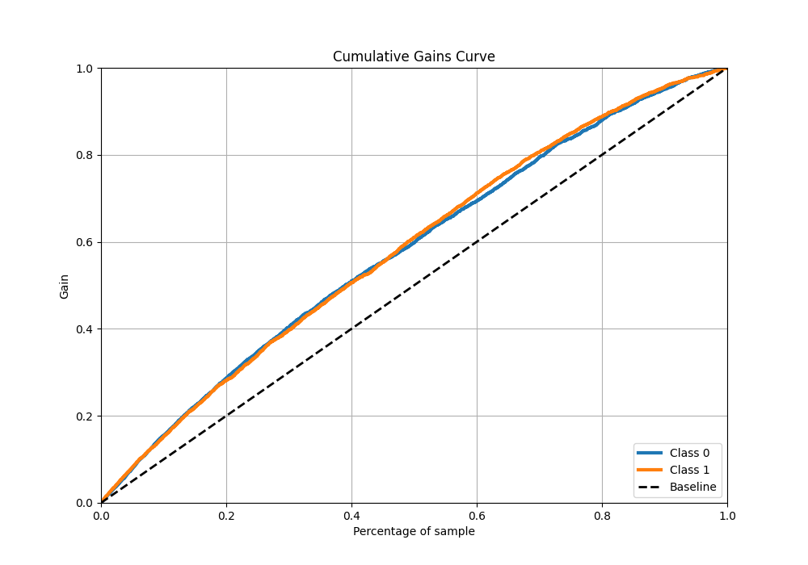
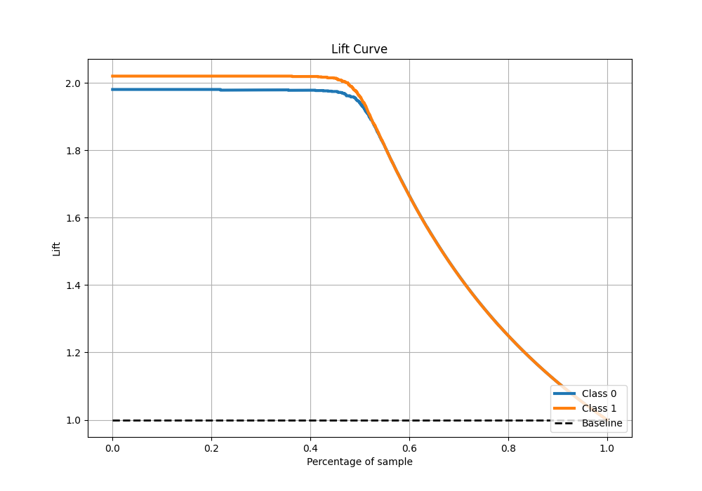

# Summary of 4_Default_NeuralNetwork

[<< Go back](../README.md)

## Neural Network
- **n_jobs**: -1
- **dense_1_size**: 32
- **dense_2_size**: 16
- **learning_rate**: 0.05
- **explain_level**: 1

## Validation
 - **validation_type**: split
 - **train_ratio**: 0.75
 - **shuffle**: True
 - **stratify**: True

## Optimized metric
logloss

## Training time

12.8 seconds

## Metric details
|           |    score |   threshold |
|:----------|---------:|------------:|
| logloss   | 0.652794 | nan         |
| auc       | 0.660344 | nan         |
| f1        | 0.680618 |   0.318911  |
| accuracy  | 0.610135 |   0.505237  |
| precision | 0.86747  |   0.912872  |
| recall    | 1        |   0.0189404 |
| mcc       | 0.233584 |   0.47393   |

## Metric details with threshold from accuracy metric
|           |    score |   threshold |
|:----------|---------:|------------:|
| logloss   | 0.652794 |  nan        |
| auc       | 0.660344 |  nan        |
| f1        | 0.654422 |    0.505237 |
| accuracy  | 0.610135 |    0.505237 |
| precision | 0.583067 |    0.505237 |
| recall    | 0.745678 |    0.505237 |
| mcc       | 0.231265 |    0.505237 |

## Confusion matrix (at threshold=0.505237)
|              |   Predicted as 0 |   Predicted as 1 |
|:-------------|-----------------:|-----------------:|
| Labeled as 0 |             1070 |             1172 |
| Labeled as 1 |              559 |             1639 |

## Learning curves

## Permutation-based Importance

## Confusion Matrix

## Normalized Confusion Matrix

## ROC Curve

## Kolmogorov-Smirnov Statistic

## Precision-Recall Curve

## Calibration Curve

## Cumulative Gains Curve

## Lift Curve

[<< Go back](../README.md)
