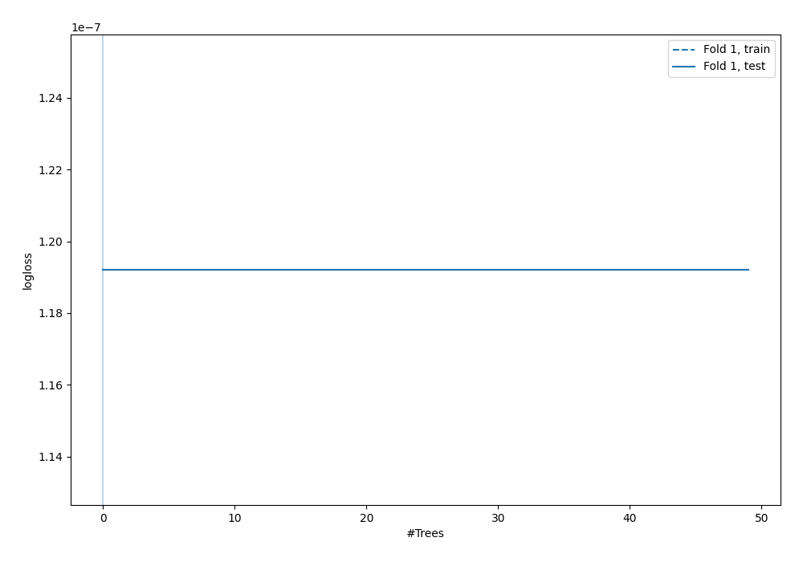
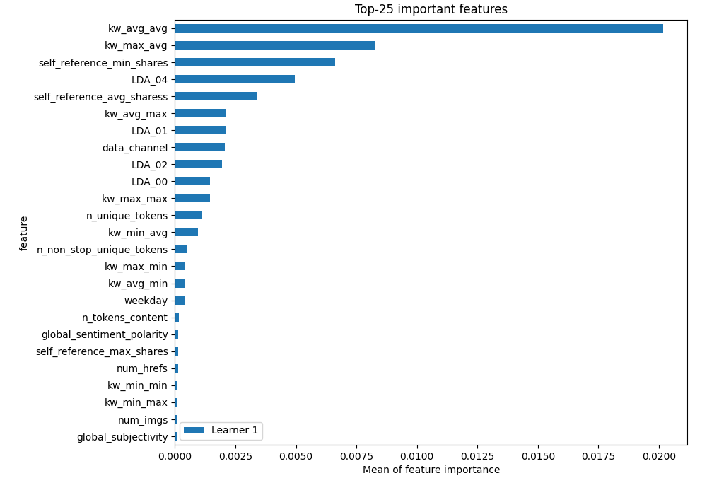
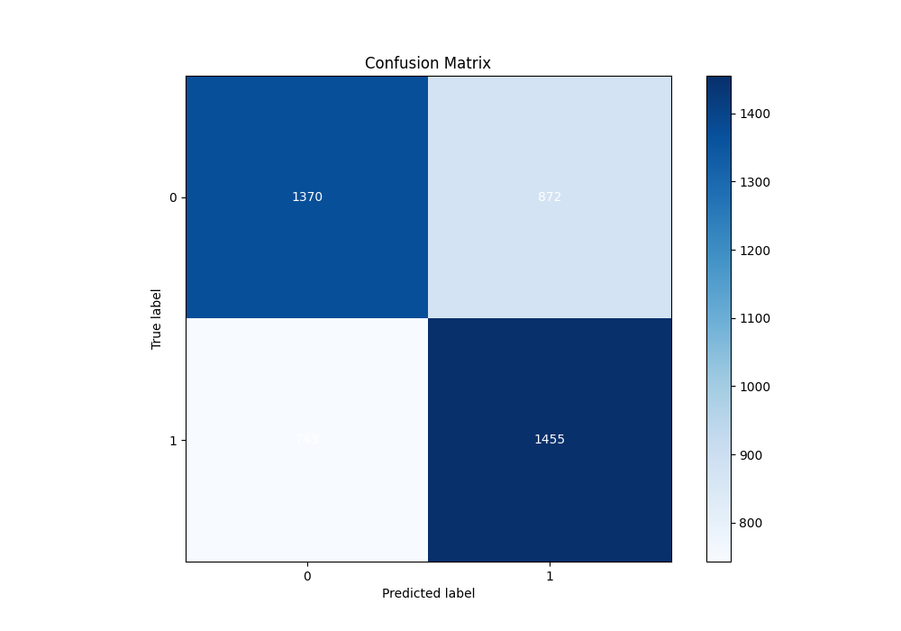
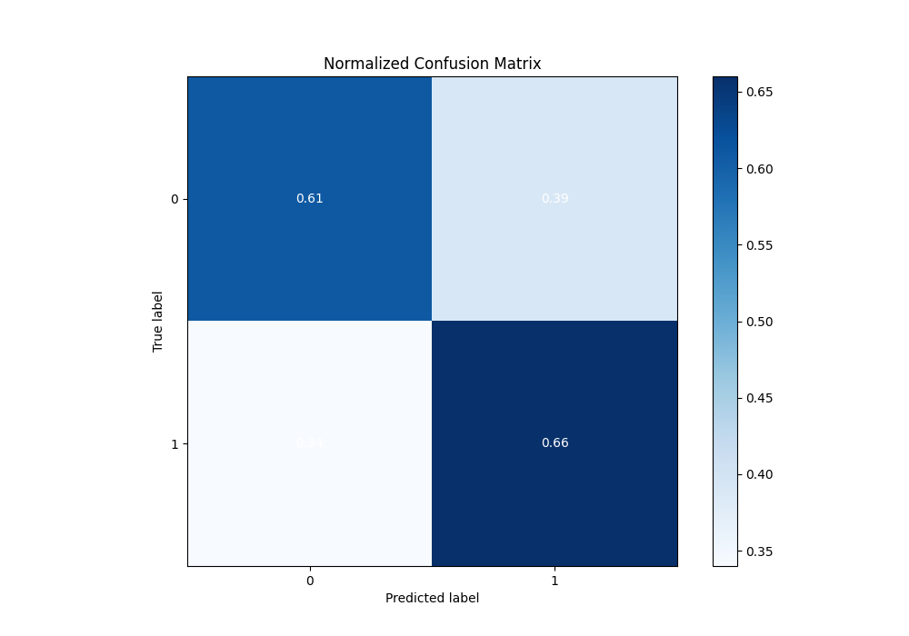
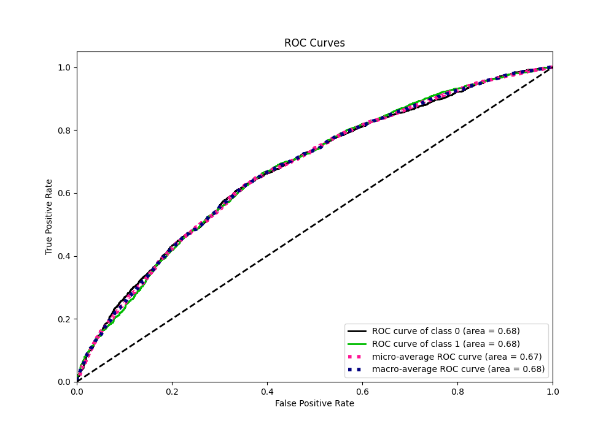
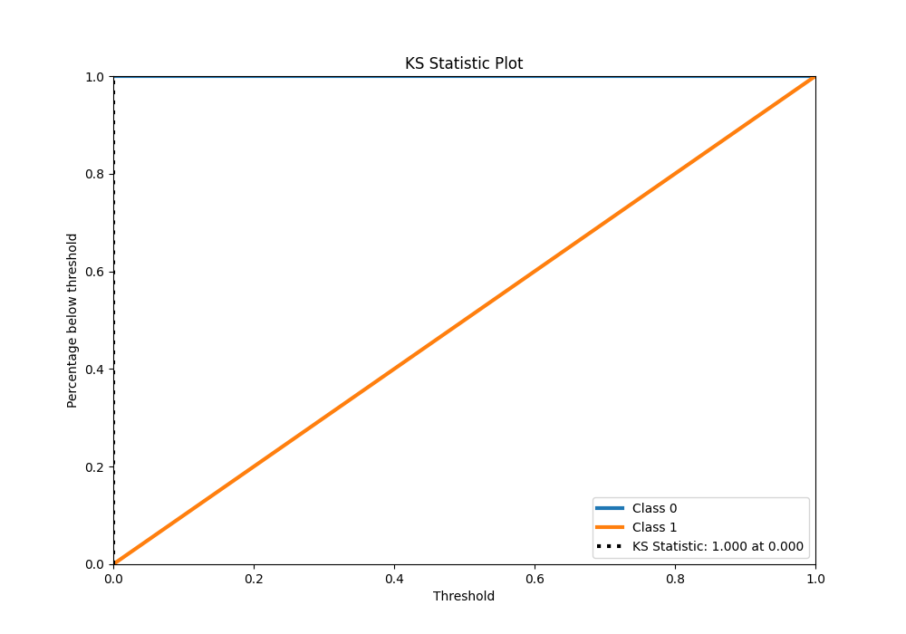
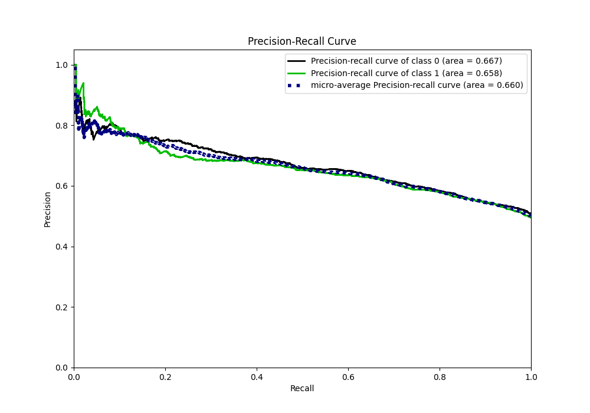
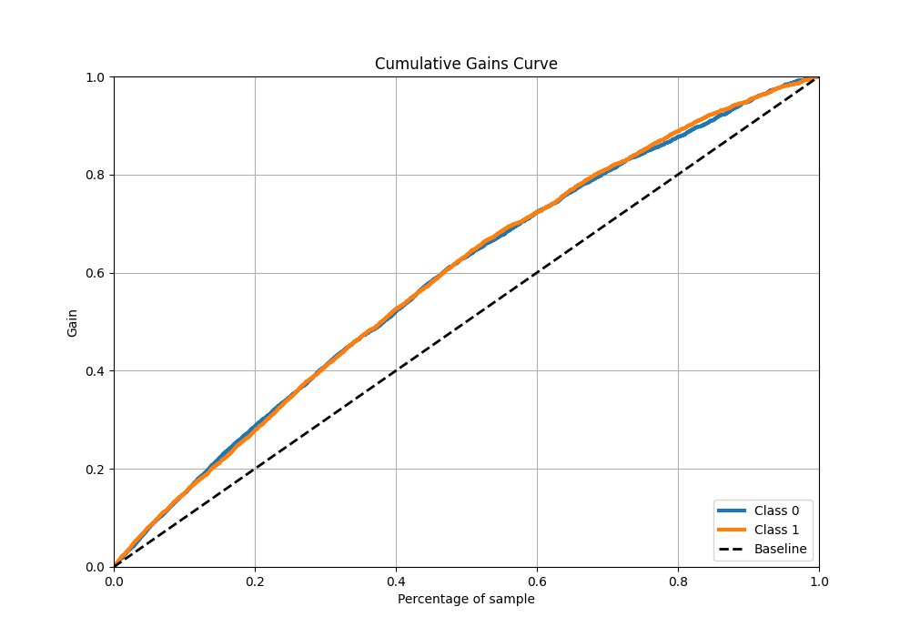
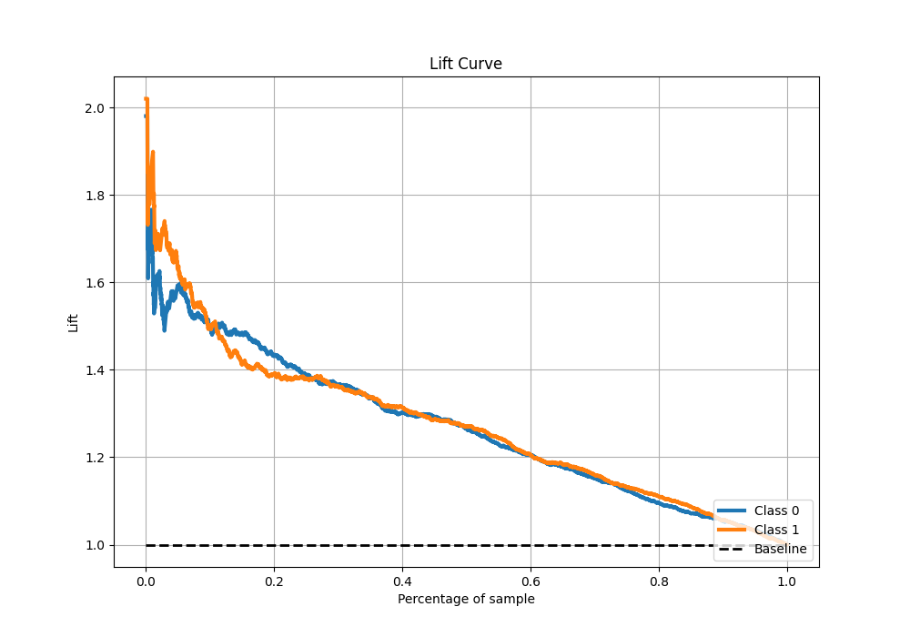

# Summary of 5_Default_RandomForest

[<< Go back](../README.md)

## Random Forest
- **n_jobs**: -1
- **criterion**: gini
- **max_features**: 0.9
- **min_samples_split**: 30
- **max_depth**: 4
- **eval_metric_name**: logloss
- **explain_level**: 1

## Validation
 - **validation_type**: split
 - **train_ratio**: 0.75
 - **shuffle**: True
 - **stratify**: True

## Optimized metric
logloss

## Training time

9.4 seconds

## Metric details
|           |    score |   threshold |
|:----------|---------:|------------:|
| logloss   | 0.648062 |  nan        |
| auc       | 0.675108 |  nan        |
| f1        | 0.680937 |    0.363349 |
| accuracy  | 0.636261 |    0.497541 |
| precision | 0.858268 |    0.680097 |
| recall    | 1        |    0.226764 |
| mcc       | 0.273331 |    0.497541 |

## Metric details with threshold from accuracy metric
|           |    score |   threshold |
|:----------|---------:|------------:|
| logloss   | 0.648062 |  nan        |
| auc       | 0.675108 |  nan        |
| f1        | 0.643094 |    0.497541 |
| accuracy  | 0.636261 |    0.497541 |
| precision | 0.625269 |    0.497541 |
| recall    | 0.661965 |    0.497541 |
| mcc       | 0.273331 |    0.497541 |

## Confusion matrix (at threshold=0.497541)
|              |   Predicted as 0 |   Predicted as 1 |
|:-------------|-----------------:|-----------------:|
| Labeled as 0 |             1370 |              872 |
| Labeled as 1 |              743 |             1455 |

## Learning curves

## Permutation-based Importance

## Confusion Matrix

## Normalized Confusion Matrix

## ROC Curve

## Kolmogorov-Smirnov Statistic

## Precision-Recall Curve

## Calibration Curve

## Cumulative Gains Curve

## Lift Curve

[<< Go back](../README.md)
