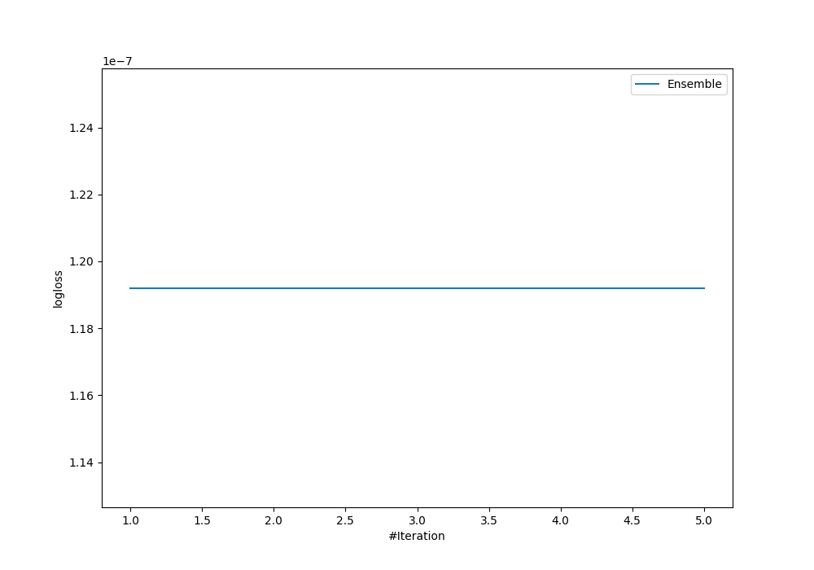
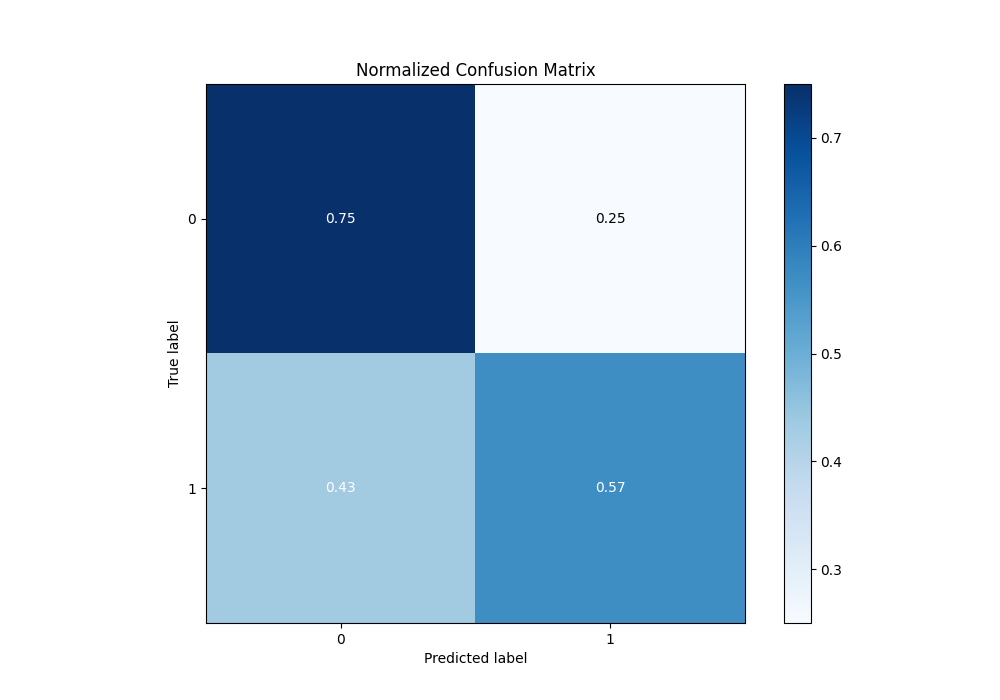
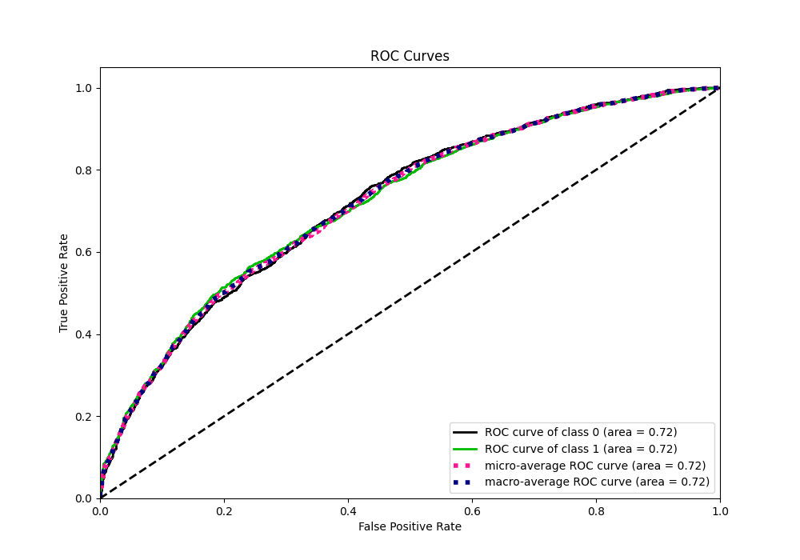
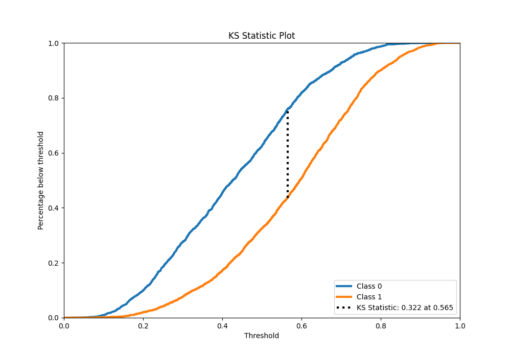
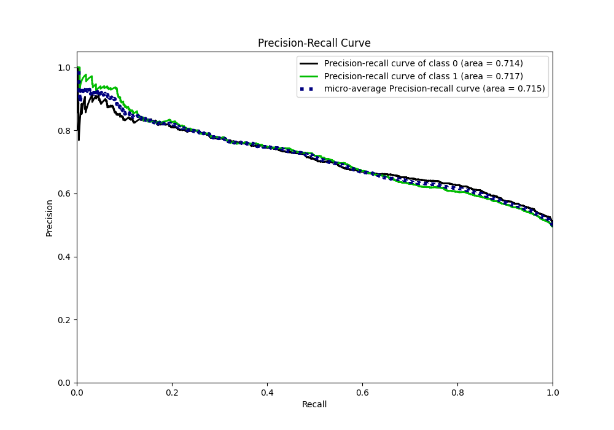
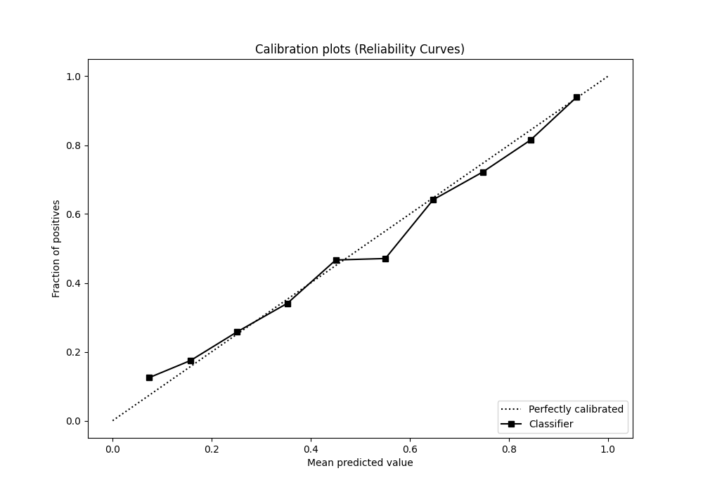
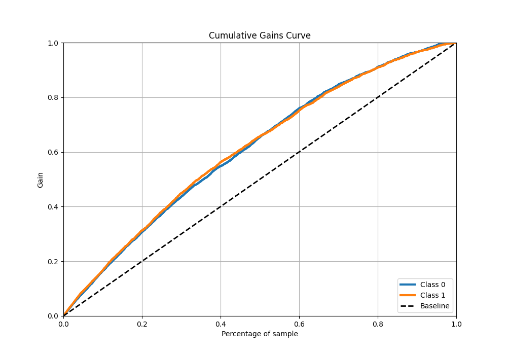
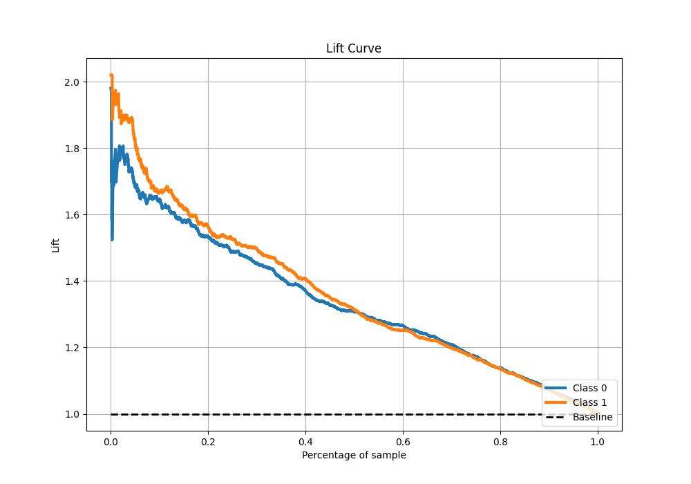

# Summary of Ensemble

[<< Go back](../README.md)

## Ensemble structure
| Model                   |   Weight |
|:------------------------|---------:|
| 3_Default_Xgboost       |        4 |
| 4_Default_NeuralNetwork |        1 |

## Metric details
|           |    score |   threshold |
|:----------|---------:|------------:|
| logloss   | 0.612507 | nan         |
| auc       | 0.721837 | nan         |
| f1        | 0.697366 |   0.349782  |
| accuracy  | 0.660586 |   0.56264   |
| precision | 0.939759 |   0.867513  |
| recall    | 1        |   0.0225398 |
| mcc       | 0.329921 |   0.600104  |

## Metric details with threshold from accuracy metric
|           |    score |   threshold |
|:----------|---------:|------------:|
| logloss   | 0.612507 |   nan       |
| auc       | 0.721837 |   nan       |
| f1        | 0.622967 |     0.56264 |
| accuracy  | 0.660586 |     0.56264 |
| precision | 0.692051 |     0.56264 |
| recall    | 0.566424 |     0.56264 |
| mcc       | 0.325209 |     0.56264 |

## Confusion matrix (at threshold=0.56264)
|              |   Predicted as 0 |   Predicted as 1 |
|:-------------|-----------------:|-----------------:|
| Labeled as 0 |             1688 |              554 |
| Labeled as 1 |              953 |             1245 |

## Learning curves

## Confusion Matrix

## Normalized Confusion Matrix

## ROC Curve

## Kolmogorov-Smirnov Statistic

## Precision-Recall Curve

## Calibration Curve

## Cumulative Gains Curve

## Lift Curve

[<< Go back](../README.md)
