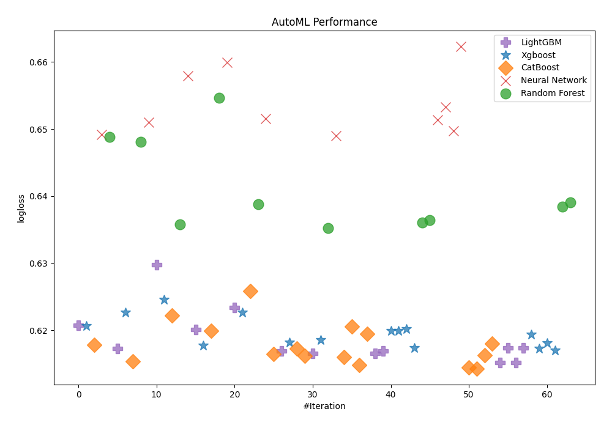
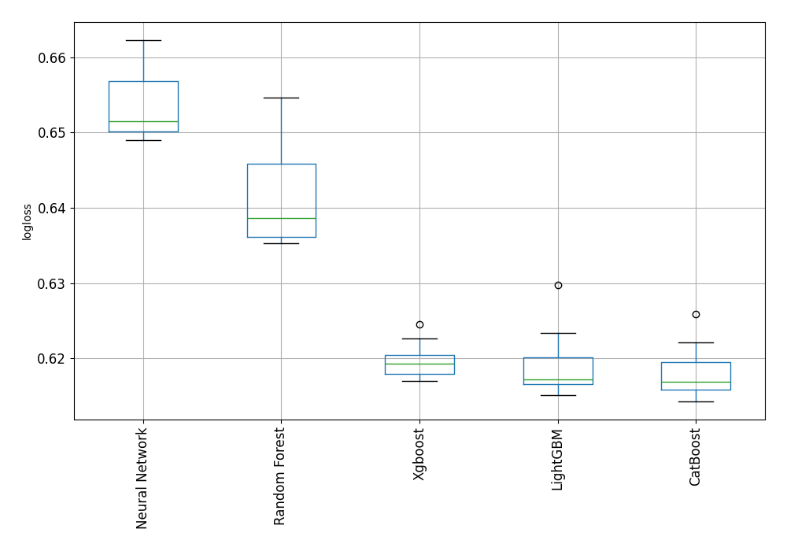

# AutoML Leaderboard

| Best model   | name                                                                                                 | model_type     | metric_type   |   metric_value |   train_time |   single_prediction_time |
|:-------------|:-----------------------------------------------------------------------------------------------------|:---------------|:--------------|---------------:|-------------:|-------------------------:|
|              | [1_Default_LightGBM](1_Default_LightGBM/README.md)                                                   | LightGBM       | logloss       |       0.620767 |        23.3  |                   0.0783 |
|              | [2_Default_Xgboost](2_Default_Xgboost/README.md)                                                     | Xgboost        | logloss       |       0.620622 |         7.27 |                   0.0415 |
|              | [3_Default_CatBoost](3_Default_CatBoost/README.md)                                                   | CatBoost       | logloss       |       0.617841 |        10.97 |                   0.0417 |
|              | [4_Default_NeuralNetwork](4_Default_NeuralNetwork/README.md)                                         | Neural Network | logloss       |       0.649157 |       100.87 |                   0.0712 |
|              | [5_Default_RandomForest](5_Default_RandomForest/README.md)                                           | Random Forest  | logloss       |       0.64885  |        40.09 |                   0.1173 |
|              | [10_LightGBM](10_LightGBM/README.md)                                                                 | LightGBM       | logloss       |       0.617241 |        14.74 |                   0.0435 |
|              | [6_Xgboost](6_Xgboost/README.md)                                                                     | Xgboost        | logloss       |       0.622679 |         8.45 |                   0.0447 |
|              | [14_CatBoost](14_CatBoost/README.md)                                                                 | CatBoost       | logloss       |       0.615393 |        24.03 |                   0.0408 |
|              | [18_RandomForest](18_RandomForest/README.md)                                                         | Random Forest  | logloss       |       0.648059 |        24.06 |                   0.1163 |
|              | [22_NeuralNetwork](22_NeuralNetwork/README.md)                                                       | Neural Network | logloss       |       0.651049 |        95.36 |                   0.0734 |
|              | [11_LightGBM](11_LightGBM/README.md)                                                                 | LightGBM       | logloss       |       0.629796 |        10.56 |                   0.0418 |
|              | [7_Xgboost](7_Xgboost/README.md)                                                                     | Xgboost        | logloss       |       0.624542 |         8.68 |                   0.0431 |
|              | [15_CatBoost](15_CatBoost/README.md)                                                                 | CatBoost       | logloss       |       0.62217  |        12.18 |                   0.0454 |
|              | [19_RandomForest](19_RandomForest/README.md)                                                         | Random Forest  | logloss       |       0.635803 |        65.71 |                   0.1177 |
|              | [23_NeuralNetwork](23_NeuralNetwork/README.md)                                                       | Neural Network | logloss       |       0.65795  |       101.54 |                   0.0667 |
|              | [12_LightGBM](12_LightGBM/README.md)                                                                 | LightGBM       | logloss       |       0.620117 |        21.53 |                   0.0426 |
|              | [8_Xgboost](8_Xgboost/README.md)                                                                     | Xgboost        | logloss       |       0.617765 |         8.55 |                   0.0459 |
|              | [16_CatBoost](16_CatBoost/README.md)                                                                 | CatBoost       | logloss       |       0.61988  |        11.72 |                   0.0441 |
|              | [20_RandomForest](20_RandomForest/README.md)                                                         | Random Forest  | logloss       |       0.654616 |        28.41 |                   0.1226 |
|              | [24_NeuralNetwork](24_NeuralNetwork/README.md)                                                       | Neural Network | logloss       |       0.659929 |       217.9  |                   0.0738 |
|              | [13_LightGBM](13_LightGBM/README.md)                                                                 | LightGBM       | logloss       |       0.6234   |        25.3  |                   0.0433 |
|              | [9_Xgboost](9_Xgboost/README.md)                                                                     | Xgboost        | logloss       |       0.62263  |         8.38 |                   0.0445 |
|              | [17_CatBoost](17_CatBoost/README.md)                                                                 | CatBoost       | logloss       |       0.625847 |        10.19 |                   0.0439 |
|              | [21_RandomForest](21_RandomForest/README.md)                                                         | Random Forest  | logloss       |       0.63876  |        48.14 |                   0.1234 |
|              | [25_NeuralNetwork](25_NeuralNetwork/README.md)                                                       | Neural Network | logloss       |       0.651521 |       100.77 |                   0.0729 |
|              | [14_CatBoost_GoldenFeatures](14_CatBoost_GoldenFeatures/README.md)                                   | CatBoost       | logloss       |       0.616412 |        31.4  |                   0.0528 |
|              | [10_LightGBM_GoldenFeatures](10_LightGBM_GoldenFeatures/README.md)                                   | LightGBM       | logloss       |       0.616935 |        12.55 |                   0.0492 |
|              | [8_Xgboost_GoldenFeatures](8_Xgboost_GoldenFeatures/README.md)                                       | Xgboost        | logloss       |       0.618163 |         8.24 |                   0.0553 |
|              | [14_CatBoost_RandomFeature](14_CatBoost_RandomFeature/README.md)                                     | CatBoost       | logloss       |       0.617316 |        25.08 |                   0.0449 |
|              | [14_CatBoost_SelectedFeatures](14_CatBoost_SelectedFeatures/README.md)                               | CatBoost       | logloss       |       0.616217 |        23.66 |                   0.0442 |
|              | [10_LightGBM_GoldenFeatures_SelectedFeatures](10_LightGBM_GoldenFeatures_SelectedFeatures/README.md) | LightGBM       | logloss       |       0.616558 |        18.6  |                   0.056  |
|              | [8_Xgboost_SelectedFeatures](8_Xgboost_SelectedFeatures/README.md)                                   | Xgboost        | logloss       |       0.618557 |         9.08 |                   0.0453 |
|              | [19_RandomForest_SelectedFeatures](19_RandomForest_SelectedFeatures/README.md)                       | Random Forest  | logloss       |       0.635274 |        43.32 |                   0.1359 |
|              | [4_Default_NeuralNetwork_SelectedFeatures](4_Default_NeuralNetwork_SelectedFeatures/README.md)       | Neural Network | logloss       |       0.648999 |        88.13 |                   0.0632 |
|              | [26_CatBoost](26_CatBoost/README.md)                                                                 | CatBoost       | logloss       |       0.615987 |        40.95 |                   0.0428 |
|              | [27_CatBoost](27_CatBoost/README.md)                                                                 | CatBoost       | logloss       |       0.62057  |        17.14 |                   0.0434 |
|              | [28_CatBoost_SelectedFeatures](28_CatBoost_SelectedFeatures/README.md)                               | CatBoost       | logloss       |       0.614801 |        41.18 |                   0.0421 |
|              | [29_CatBoost_SelectedFeatures](29_CatBoost_SelectedFeatures/README.md)                               | CatBoost       | logloss       |       0.619426 |        14.89 |                   0.0398 |
|              | [30_LightGBM_GoldenFeatures_SelectedFeatures](30_LightGBM_GoldenFeatures_SelectedFeatures/README.md) | LightGBM       | logloss       |       0.616558 |        19.2  |                   0.0534 |
|              | [31_LightGBM_GoldenFeatures](31_LightGBM_GoldenFeatures/README.md)                                   | LightGBM       | logloss       |       0.616935 |        12.83 |                   0.0543 |
|              | [32_Xgboost](32_Xgboost/README.md)                                                                   | Xgboost        | logloss       |       0.619893 |        10    |                   0.0448 |
|              | [33_Xgboost](33_Xgboost/README.md)                                                                   | Xgboost        | logloss       |       0.619931 |        10.07 |                   0.0417 |
|              | [34_Xgboost_GoldenFeatures](34_Xgboost_GoldenFeatures/README.md)                                     | Xgboost        | logloss       |       0.62021  |         8.89 |                   0.0571 |
|              | [35_Xgboost_GoldenFeatures](35_Xgboost_GoldenFeatures/README.md)                                     | Xgboost        | logloss       |       0.617325 |         8.98 |                   0.0562 |
|              | [36_RandomForest_SelectedFeatures](36_RandomForest_SelectedFeatures/README.md)                       | Random Forest  | logloss       |       0.636035 |        54.02 |                   0.134  |
|              | [37_RandomForest](37_RandomForest/README.md)                                                         | Random Forest  | logloss       |       0.63641  |        45.69 |                   0.1338 |
|              | [38_NeuralNetwork_SelectedFeatures](38_NeuralNetwork_SelectedFeatures/README.md)                     | Neural Network | logloss       |       0.651394 |        15.04 |                   0.0684 |
|              | [39_NeuralNetwork_SelectedFeatures](39_NeuralNetwork_SelectedFeatures/README.md)                     | Neural Network | logloss       |       0.653288 |       133.14 |                   0.0701 |
|              | [40_NeuralNetwork](40_NeuralNetwork/README.md)                                                       | Neural Network | logloss       |       0.649765 |        14.17 |                   0.0697 |
|              | [41_NeuralNetwork](41_NeuralNetwork/README.md)                                                       | Neural Network | logloss       |       0.662282 |       157.12 |                   0.0686 |
|              | [42_CatBoost_SelectedFeatures](42_CatBoost_SelectedFeatures/README.md)                               | CatBoost       | logloss       |       0.61444  |        38.24 |                   0.0368 |
| **the best** | [43_CatBoost_SelectedFeatures](43_CatBoost_SelectedFeatures/README.md)                               | CatBoost       | logloss       |       0.614301 |        43.66 |                   0.0421 |
|              | [44_CatBoost](44_CatBoost/README.md)                                                                 | CatBoost       | logloss       |       0.616229 |        30.89 |                   0.0423 |
|              | [45_CatBoost](45_CatBoost/README.md)                                                                 | CatBoost       | logloss       |       0.618007 |        25.48 |                   0.0437 |
|              | [46_LightGBM_GoldenFeatures_SelectedFeatures](46_LightGBM_GoldenFeatures_SelectedFeatures/README.md) | LightGBM       | logloss       |       0.615163 |        20.77 |                   0.0496 |
|              | [47_LightGBM_GoldenFeatures_SelectedFeatures](47_LightGBM_GoldenFeatures_SelectedFeatures/README.md) | LightGBM       | logloss       |       0.617359 |        21.76 |                   0.0491 |
|              | [48_LightGBM_GoldenFeatures_SelectedFeatures](48_LightGBM_GoldenFeatures_SelectedFeatures/README.md) | LightGBM       | logloss       |       0.615163 |        20.92 |                   0.0547 |
|              | [49_LightGBM_GoldenFeatures_SelectedFeatures](49_LightGBM_GoldenFeatures_SelectedFeatures/README.md) | LightGBM       | logloss       |       0.617359 |        21.68 |                   0.055  |
|              | [50_Xgboost_GoldenFeatures](50_Xgboost_GoldenFeatures/README.md)                                     | Xgboost        | logloss       |       0.619343 |         9.98 |                   0.055  |
|              | [51_Xgboost_GoldenFeatures](51_Xgboost_GoldenFeatures/README.md)                                     | Xgboost        | logloss       |       0.617242 |        10.39 |                   0.0575 |
|              | [52_Xgboost](52_Xgboost/README.md)                                                                   | Xgboost        | logloss       |       0.618063 |        11.14 |                   0.048  |
|              | [53_Xgboost](53_Xgboost/README.md)                                                                   | Xgboost        | logloss       |       0.616972 |        11.99 |                   0.0442 |
|              | [54_RandomForest_SelectedFeatures](54_RandomForest_SelectedFeatures/README.md)                       | Random Forest  | logloss       |       0.638457 |        37.16 |                   0.1283 |
|              | [55_RandomForest](55_RandomForest/README.md)                                                         | Random Forest  | logloss       |       0.639031 |        50.67 |                   0.1341 |

### AutoML Performance

### AutoML Performance Boxplot
